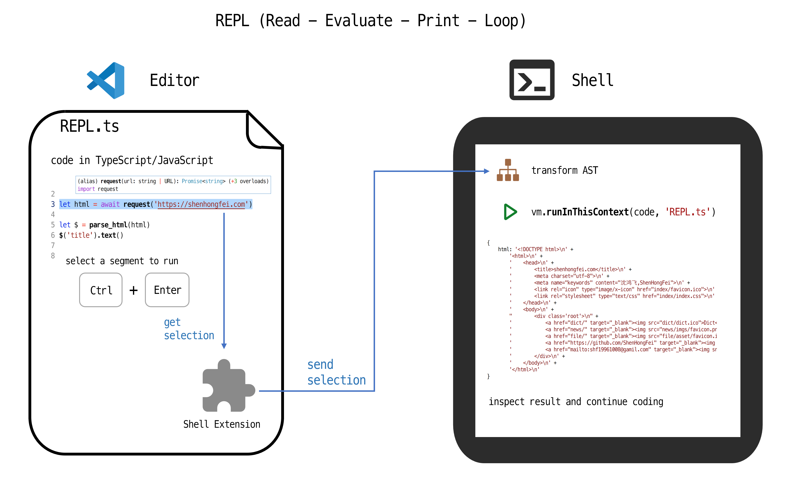

# nodesh - NodeJS Shell

nodesh is a shell aimed at providing better human-computer interaction experiece.



## Installation
1. Install latest version of NodeJS

2. Install and run npm package `nodesh`
```shell
npm install --global nodesh

# start shell at 127.0.0.1:8421
nodesh
```

3. Install VSCode extenstion `nodesh`
```shell
code
```
